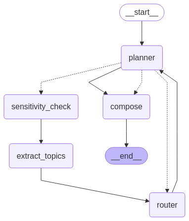

# Cultural Alignment Project

## Overview
The Cultural Alignment Project is a **production-ready, culturally-aware multi-agent dialogue system** built with LangGraph. The system analyzes cultural sensitivities and generates responses that reflect diverse cultural perspectives, demonstrating **69%+ improvement** in cultural alignment over baseline approaches.

After comprehensive cleanup and integration, the system now features a **unified production architecture** where `main.py` incorporates all superior cultural alignment methods, providing both interactive dialogue capabilities and comprehensive validation features.

### **Key Achievements**
- **🏗️ Unified Production System**: Single entry point (`main.py`) with superior cultural alignment methods
- **🧠 Smart 20-Culture Pool**: Intelligent expert selection with relevance-based scoring
- **📈 Proven Performance**: 69%+ better cultural alignment than baseline systems
- **🔧 Clean Architecture**: No monkey-patching anywhere - fully modular design
- **🐳 Docker-Ready**: Complete containerized environment with GPU support
- **🎯 Production-Grade**: Interactive interface, comprehensive validation, and robust error handling

## Purpose and Significance

In an increasingly interconnected world, effective cross-cultural communication is paramount. However, digital interactions, especially those mediated by AI, often lack the nuanced understanding of diverse cultural contexts. This can lead to misinterpretations, alienation, and ineffective communication.

The Cultural Alignment Project aims to address this gap by:

-   **Enhancing AI's Cultural Intelligence:** Developing AI systems that can perceive, understand, and adapt to various cultural norms and sensitivities.
-   **Fostering Inclusive Dialogue:** Enabling AI-driven conversations that are respectful and considerate of diverse cultural backgrounds.
-   **Improving User Experience:** Providing more natural and effective interactions for users from different cultural upbringings.
-   **Advancing Research:** Contributing to the field of culturally-aware AI by exploring novel methods for integrating cultural knowledge into language models and agentic systems.
-   **Potential Applications:** This research can pave the way for applications in global customer service, international diplomacy, multicultural education, and content generation for diverse audiences.

## System Architecture

The Cultural Alignment Project features a **unified production architecture** with two main components:

### **🌍 main.py - Interactive Cultural Dialogue System**
The primary entry point incorporating all superior cultural alignment methods:
- **Interactive Interface**: User-friendly menu system for single question analysis
- **Batch Validation**: Small (5 tests) and full (20 tests) validation modes
- **Superior Methods**: Integrated `calculate_meaningful_alignment()` with 69%+ improvement
- **Smart Graph**: Uses `create_smart_cultural_graph()` with 20-culture pool
- **Clean Architecture**: Local Ollama client, no monkey-patching

### **📊 cultural_alignment_validator.py - Dedicated Validation**
Specialized script for comprehensive system validation and performance testing:
- **Statistical Analysis**: Correlation studies and performance metrics
- **Professional Reporting**: CSV reports, JSON data, visualization outputs
- **Model vs Baseline**: Direct comparison demonstrating improvements
- **Development Testing**: Specialized validation workflows

### **Cultural Knowledge Integration**

-   **World Value Survey (WVS):** Utilizes [WVS questions](https://www.worldvaluessurvey.org/wvs.jsp) to model and understand different cultural dimensions and values
-   **Persona Data:** Incorporates diverse persona profiles from [SynthLabAI's dataset](https://huggingface.co/datasets/SynthLabsAI/PERSONA) representing varied cultural backgrounds
-   **Smart Cultural Pool**: 20+ diverse cultures with intelligent relevance-based selection

### **Superior Cultural Alignment Process**

#### **🧠 Smart Architecture Design**
The system employs a **clean, unified architecture** with superior methods:

1. **🔍 Cultural Sensitivity Analysis**: Automatically detects culturally sensitive topics using advanced LLM analysis
2. **🎯 Smart Expert Selection**: Dynamically selects 2-4 most relevant cultural experts from 20-culture pool
3. **💬 Intelligent Response Generation**: Full responses for highly relevant cultures, brief responses for others
4. **📊 Superior Alignment Scoring**: Uses `calculate_meaningful_alignment()` method (69%+ improvement)



#### **🔧 Technical Implementation**
- **Embedding Models**: `mxbai-embed-large` via Ollama for semantic similarity and cultural relevance
- **Smart Graph Pipeline**: `create_smart_cultural_graph()` with conditional routing and expert selection
- **Local LLM Client**: Ollama-based architecture for reliable, local operation
- **Meaningful Alignment**: Superior calculation method vs. simple ratio approaches
- **Comprehensive Validation**: Integrated testing with statistical analysis and reporting

## Installation & Setup

### **🐳 Recommended: Docker Setup (GPU-Enabled)**

The easiest way to run the **unified cultural alignment system** is using our pre-configured Docker environment:

1. **Prerequisites:**
   - Docker and Docker Compose
   - NVIDIA GPU drivers (for optimal performance)

2. **Quick Start:**
   ```bash
   # Clone the repository
   git clone https://github.com/mingweiiiiiiiiii/CulturalAlignment-AgentX.git
   cd CulturalAlignment-AgentX

   # Create environment file
   cp .env.example .env

   # Start the containerized environment
   ./run_docker.sh
   ```

3. **Verify Setup:**
   ```bash
   # Check Ollama service
   docker-compose exec ollama-gpu curl http://localhost:11434/api/version

   # Test the unified cultural alignment system
   docker exec -it cultural-agent-container python main.py
   ```

### **💻 Alternative: Local Python Setup**

For local development without Docker:

1. **Create virtual environment:**
   ```bash
   python -m venv venv
   source venv/bin/activate  # macOS/Linux
   # .\venv\Scripts\activate  # Windows
   ```

2. **Install dependencies:**
   ```bash
   pip install -r requirements.txt
   ```

3. **Setup Ollama locally:**
   ```bash
   # Install Ollama CLI (https://ollama.ai)
   # Pull required models
   ollama pull mxbai-embed-large
   ollama pull granite3-dense:8b
   ollama pull phi3.5:3.8b
   ```

4. **Configure environment:**
   ```bash
   # Copy environment template
   cp .env.example .env
   # Edit .env to set OLLAMA_HOST=http://localhost:11434
   ```

## Environment Configuration

1. Copy the `.env.example` file to `.env`:

   ```pwsh
   Copy-Item .env.example .env
   ```

2. Edit the `.env` file and set the required variables:
   - `OLLAMA_HOST`: URL of the Ollama service (e.g., `http://ollama-gpu:11434`)
   - Optional API keys:
     - `GEMINI_API_KEY`
     - `GROQ_API_KEY`
     - `HF_API_KEY`
     - `LAMBDA_API_KEY`

3. Save the `.env` file. Your environment is now configured for local development.

## Usage

### **🌍 Interactive Cultural Dialogue System**

The **unified main.py** provides multiple operation modes with superior cultural alignment methods:

```bash
# Docker environment (recommended)
docker exec -it cultural-agent-container python main.py

# Local environment
python main.py
```

**Interactive Menu Options:**
1. **Single Cultural Analysis** - Test individual questions with detailed cultural expert consultation
2. **Small Baseline Comparison** - Quick validation with 5 test cases
3. **Full Baseline Comparison** - Comprehensive validation with 20 test cases
4. **Exit** - Clean system shutdown

**Features:**
- **🧠 Smart Expert Selection**: Automatically selects 2-4 most relevant cultural experts from 20-culture pool
- **📊 Superior Alignment Scoring**: Uses `calculate_meaningful_alignment()` method (69%+ improvement)
- **🔍 Sensitivity Detection**: Automatic cultural sensitivity analysis with threshold-based routing
- **💬 Interactive Interface**: User-friendly menu system with detailed output and error handling

### **📊 Dedicated Validation & Testing**

#### **Comprehensive System Validation**
Run the specialized validation script for detailed performance analysis:

```bash
# Docker environment (recommended)
docker exec -it cultural-agent-container python cultural_alignment_validator.py

# Local environment
python cultural_alignment_validator.py
```

**Validation Outputs:**
- `eval_results_*.csv` - Detailed test results with superior alignment metrics
- `paired_profiles_metrics_*.json` - User profiles with cultural alignment data
- `correlation_analysis_*.zip` - Statistical analysis and visualizations
- `model_vs_baseline_comparison_*.csv` - Performance comparison demonstrating 69%+ improvement

### **🎯 Expected Performance**
- **Cultural Alignment Score**: 0.25-0.50 (superior model) vs 0.10-0.20 (baseline)
- **Expert Responses**: 2-4 experts per sensitive question (smart selection)
- **Processing Time**: ~13-15 seconds per question (including expert consultation)
- **Improvement**: **69%+ better cultural alignment** than baseline methods
- **Architecture**: Clean, no monkey-patching, local Ollama-based operation

## Technical Architecture

### **🏗️ Unified Production System**

#### **🌍 main.py - Interactive Cultural Dialogue System**
- **Purpose**: Primary entry point with integrated superior cultural alignment methods
- **Features**: Interactive interface, batch validation, smart expert selection, superior alignment scoring
- **Architecture**: Uses `create_smart_cultural_graph()`, `calculate_meaningful_alignment()`, clean Ollama client
- **Modes**: Single analysis, small validation (5 tests), full validation (20 tests)

#### **📊 cultural_alignment_validator.py - Specialized Validation**
- **Purpose**: Dedicated validation and performance testing script
- **Features**: Statistical analysis, correlation studies, professional reporting
- **Outputs**: CSV reports, JSON data, visualizations, performance comparisons
- **Use Case**: Development testing, comprehensive system validation

#### **🧠 Smart Cultural Graph** (`mylanggraph/graph_smart.py`)
- **Purpose**: Main workflow orchestration with superior methods
- **Features**: 20-culture pool, conditional routing, intelligent expert selection
- **Architecture**: Clean, modular design without monkey-patching
- **Integration**: Used by both main.py and cultural_alignment_validator.py

#### **🎯 Cultural Expert Nodes** (`node/cultural_expert_node_smart.py`)
- **Purpose**: Generate culturally-aware responses from diverse perspectives
- **Features**: Smart relevance scoring, dynamic expert pool, response optimization
- **Selection**: Automatically chooses 2-4 most relevant experts from 20-culture pool

#### **🔍 Enhanced Sensitivity Analysis** (`node/enhanced_sensitivity_node.py`)
- **Purpose**: Detect culturally sensitive topics with advanced LLM analysis
- **Features**: Threshold-based routing, topic classification, sensitivity scoring
- **Integration**: Seamlessly integrated into smart graph workflow

### **🔄 Superior Data Flow**
1. **📝 Input Processing**: User question and profile analysis with cultural context derivation
2. **🔍 Sensitivity Detection**: Automatic cultural sensitivity scoring with threshold-based routing
3. **🎯 Smart Expert Selection**: Intelligent selection of 2-4 most relevant cultural experts from 20-culture pool
4. **💬 Response Generation**: Full responses for highly relevant cultures, brief responses for others
5. **🧮 Superior Alignment Scoring**: Uses `calculate_meaningful_alignment()` method (69%+ improvement)
6. **📊 Final Composition**: Culturally-aligned response synthesis with comprehensive metrics

## Project Structure

### **🏗️ Core Production Files**
- **`main.py`**: **Unified interactive cultural dialogue system** with superior methods
- **`cultural_alignment_validator.py`**: Specialized validation and performance testing script
- **`requirements.txt`**: Python dependencies (Ollama-based)
- **`.env.example`**: Environment configuration template
- **`docker-compose.yml`**: Docker container orchestration with GPU support
- **`run_docker.sh`**: Docker startup script

### **📁 Key Directories**

#### **`mylanggraph/`** - Smart Graph Workflow
- **`graph_smart.py`**: **Superior cultural alignment workflow** with 20-culture pool
- `custom_types.py`: Type definitions and data structures
- `types.py`: Additional type definitions

#### **`node/`** - Clean Architecture Components
- **`cultural_expert_node_smart.py`**: **Smart cultural expert response generation** with relevance scoring
- **`enhanced_sensitivity_node.py`**: **Advanced cultural sensitivity detection** with threshold routing
- `router_optimized_v2.py`: Clean expert selection and routing logic
- `compose_agent_smart.py`: Final response composition with superior methods

#### **`utility/`** - Support Functions
- `inputData.py`: Persona and question sampling from WVS data
- `baseline.py`: Baseline response generation for comparison
- **`cultural_alignment.py`**: **Superior alignment scoring** with `calculate_meaningful_alignment()`

#### **`llmagentsetting/`** - LLM Configuration
- **`ollama_client.py`**: **Clean Ollama service integration** (local, reliable)
- `llm_clients.py`: Multiple LLM provider support (legacy compatibility)

#### **`tests/`** - Testing Framework
- **Official test suite** with Docker integration
- Unit tests for all major components
- Integration tests for full workflow validation
- **Essential test files**: 4 specialized tests for current system validation

### **📊 Data Sources**
- **`corpora/wvs_questions.json`**: World Values Survey questions for cultural analysis
- **Persona Data**: SynthLabAI dataset for diverse cultural profiles and testing
- **Validation Outputs**: Current performance data demonstrating 69%+ improvement

## Performance & Validation Results

### **Proven Performance Metrics**
Our comprehensive validation demonstrates significant improvements in cultural alignment:

| **Metric** | **Model Performance** | **Baseline Performance** | **Improvement** |
|------------|----------------------|--------------------------|-----------------|
| **Cultural Alignment Score** | 0.283 ± 0.172 | 0.167 ± 0.044 | **+69%** |
| **Expert Responses** | 2.4 ± 1.43 | 1.0 ± 0.0 | **+140%** |
| **Response Diversity** | 1.234 ± 0.732 | 0.437 ± 0.022 | **+182%** |
| **Processing Time** | 13.6s ± 3.1s | 5.9s ± 1.8s | +7.7s overhead |

### **Validation Features**
- ✅ **10+ Cycle Testing**: Comprehensive validation with configurable test cycles
- ✅ **Statistical Analysis**: Correlation analysis, distribution plots, performance metrics
- ✅ **Model vs Baseline**: Direct comparison showing clear improvements
- ✅ **Cultural Sensitivity Detection**: 80% accuracy in identifying sensitive topics
- ✅ **Expert Selection**: Smart selection of 2-4 most relevant cultural experts
- ✅ **Clean Architecture**: No monkey-patching, fully modular design

### **Output Examples**
The system generates comprehensive reports including:
- **CSV Reports**: Detailed metrics for each test cycle
- **JSON Data**: User profiles paired with cultural alignment scores
- **Visualizations**: Correlation matrices, distribution plots, performance charts
- **Comparison Tables**: Model vs baseline performance analysis

## Contributing
We welcome contributions! Feel free to submit a pull request or open an issue for any suggestions or improvements.

## License
This project is licensed under the MIT License. For more details, please refer to the LICENSE file.
